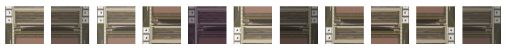

# image_augmentation_pipeline
* 使用 imgaug 進行實作 (img_iaa.py), 每一次在給定機率下執行擴增。 
* 加入 custom augmentation (img_custom.py), 每一次 image 均執行此 custom 隨機調整亮度與對比。 

## 1. imgaug + custom 實作
### 使用方式：
```python=
    # 讀取圖檔
    img = cv2.imread('sample/sample.jpg')  
    img = cv2.resize(img, (224,224))
    img = cv2.cvtColor(img, cv2.COLOR_BGR2RGB)
    img= np.array(img, dtype=np.float32)
    img_origin=img.copy()
    
    # 實例化
    Augmenation=train_augmentations()
    
    # loop 產生擴增圖片
    plt.figure(figsize=(20,20))
    for i in range(10):

        # 擴增
        output=Augmenation(img)

        # plt image
        plt.subplot(1, 11, 1)
        plt.imshow(img_origin.astype(np.uint8))
        plt.axis('off')
        plt.subplot(1, 11, i+2)
        plt.imshow(output.astype(np.uint8))
        plt.axis('off')
    
    plt.show()
```
### 此處可增加 imgaug function (位於 img_iaa.py)：
```
class sequence_iaa:
    def __init__(self,probility):
        sometimes = lambda aug: iaa.Sometimes(probility, aug)
        self.sequence = iaa.Sequential([
                sometimes(iaa.Fliplr(0.6)),
                sometimes(iaa.Flipud(0.6)),
                sometimes(iaa.ChannelShuffle(0.2)),
                sometimes(iaa.GaussianBlur(sigma=0.8)),
                ],random_order=True)
```
> 更多 augmentation 方式可參考：https://github.com/aleju/imgaug

### output :


## 2. 建立 generator 加入到 keras fit_generator 的方式可參考：
> https://github.com/aleju/imgaug/issues/66


